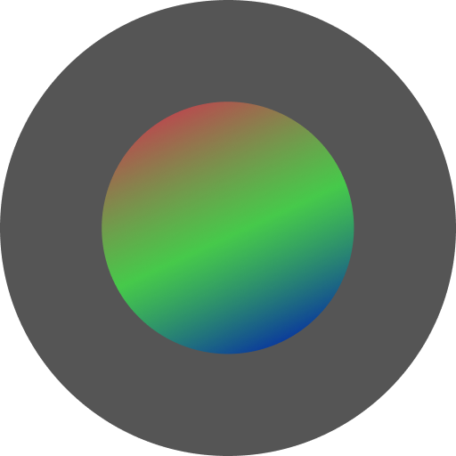

unprocess
=========

**unprocess** is a lightweight, open-source Android camera application designed to capture pure, unprocessed images and videos, bypassing the aggressive computational photography (over-sharpening, heavy noise reduction, and unnatural tone mapping) typical of modern mobile devices. 

Based originally on the Google Camera2Basic sample, it has been heavily extended to support film simulations, real-time procedural analog video styles, multiple aspect ratios, and custom file formats.

---

Features
--------

### 📸 Photo Mode
Images are sourced directly from the camera sensor:
* **Output Formats**: Save as raw sensor data (**RAW / .dng**), compressed **JPEG**, or high-efficiency **WebP** images.
* **Aspect Ratios**: Toggle between **4:3 (Full)**, **1:1 (Square)**, and **16:9 (Widescreen)**.
* **Physical Lens Switching**: Easily switch between all available physical camera lenses on your device (e.g., Ultra-Wide, Wide, Telephoto) using the dynamic lens selector.
* **Lightroom-Style Film Simulations**:
  * **Normal**: The standard, unprocessed direct camera sensor output.
  * **Film Gold**: Warm amber cast, soft skin tones, lifted shadows with amber warmth, muted greens/blues, and a gentle vintage contrast.
  * **Film Super**: Cooler overall rendering with a trademark green-cyan shadow cast, vibrant greens, cyan-shifted blues, and visible grain.
  * **Film Nectar**: High-vibrance rendering that preserves color detail, rich reds/magentas, neutral-to-cool tones, and fine grain.
  * **Film Dyna**: A natural, high-dynamic-range rendering that reveals highlight/shadow detail using local contrast (Clarity) without halos or color distortion.

### 🎥 Video Mode & Analogue Presets
Record high-resolution videos using either a clean standard pipeline or advanced retro video simulation filters:
* **Normal Video**: Clean, un-graded recording up to **MAX device resolution** with customizable frame rates (18 FPS, 24 FPS, 30 FPS, 60 FPS) and aspect ratios (4:3, 1:1, 16:9).
* **Super8**:
  * Framerate locked to the native format's **18 FPS** at a **4:3 aspect ratio**.
  * Radial chromatic aberration and corner softness simulating vintage f/1.8 zoom lenses.
  * Exposure/projector flicker, physical highlight halation (red-orange light bleed in emulsion), and a custom dye crosstalk matrix.
  * Wobbling scratches, round dust particles, gate weave (physical camera jitter), and aged print fade.
  * A retro film-reel UI progress bar simulating a 200-second countdown.
* **VHS Preset**:
  * Framerate locked to the European standard **25 FPS** at a **4:3 aspect ratio**.
  * Bandwidth split simulating luma FM (~3 MHz) and chroma color-under (~0.6 MHz), creating classic horizontal color smearing/bleeding.
  * Scanline-level jitter (time-base error), bottom-edge head-switching tear, occasional scrolling tracking wrinkle, and tape dropout lines.
  * Muted color palette, video-style lifted blacks, FM white-clip compression, tape damage snow, and subtle interlace line hints.

### 🛠️ User Experience & Interface
* **Slide-Down Settings Panel**: A modern settings overlay for quick access to crop ratios, frame rates, video resolutions, output formats, and active filters.
* **Media Review Overlay**: View the captured photo or play back the recorded video inside the app immediately after capture. Dismiss the review and resume the camera feed with a single click.
* **Optimized Frame Layouts**: Fully responsive preview scaling that prevents stretched/distorted viewfinders on device orientation changes or cold startups.

---

Technical Implementation
------------------------

* **RAW Capture & Development**: Built on top of Android's [Camera2 API][1]. When saving as JPEG or WebP, the application reads raw sensor frames, converts them into bitmap data, applies color science programmatically, and encodes them, ensuring full control over the final compression without system-level post-processing.
* **Multi-Threaded CPU Filter Pipeline**: To handle high-resolution photos (12+ Megapixels), the film simulation engine (`FilmFilter`) processes bitmap data in parallel row chunks utilizing all available CPU cores. Pre-computed HSV weights and combined LUT matrices ensure zero memory bloat and rapid processing.
* **GL Shader Video Pipeline**: Real-time video presets (`AnalogLookRenderer`) are built using custom OpenGL ES 2.0 vertex and fragment shaders. Frame consumption runs on a dedicated thread, outputting directly to the hardware media encoder surface to maintain synchronization with audio tracks and avoid drops.

[1]: https://developer.android.com/reference/android/hardware/camera2/package-summary.html

---

Getting Started
---------------

### Prerequisites
* Android SDK 21+ (compiled with SDK 36)
* Android Studio (Ladybug or newer recommended)
* Android device running Android 5.0+ with **Camera2 RAW** support (required for photo modes)

Support & Contributions
-----------------------

Patches, bug reports, and features are welcome! Feel free to fork the repository and submit a pull request.

